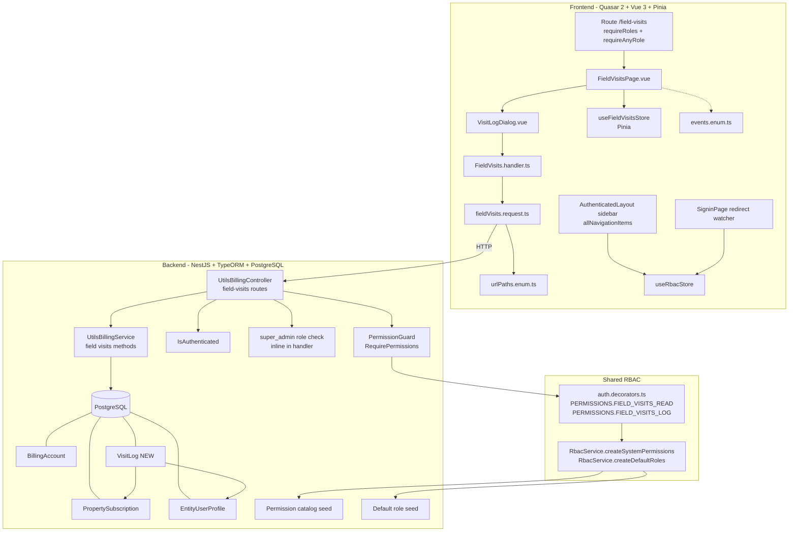
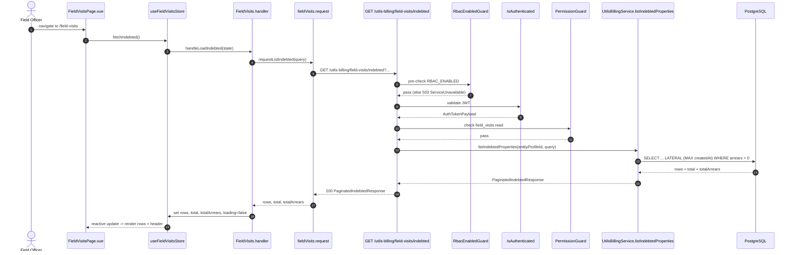
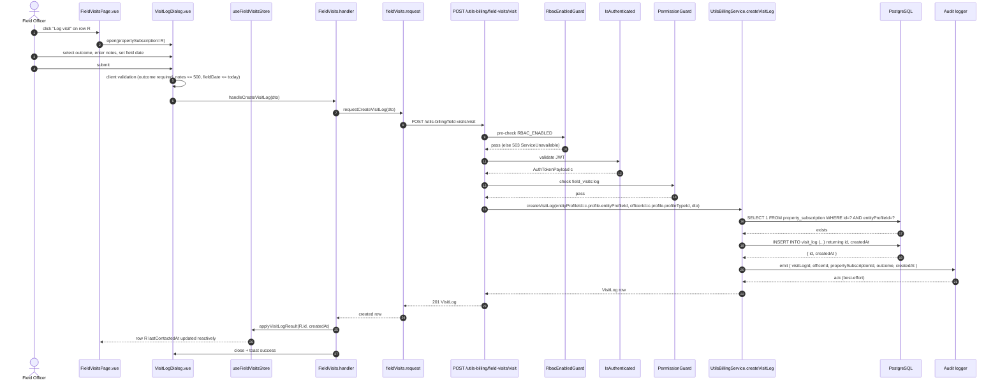
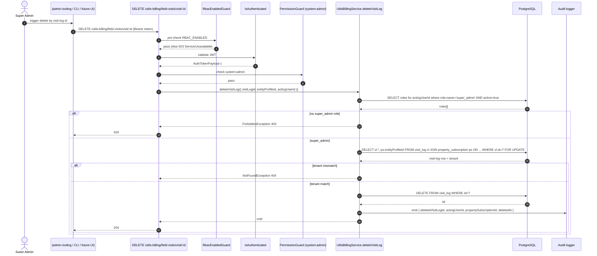

# Design Document — Field Visits

## Overview

The Field Visits feature adds a single new authenticated page to the WastePro operator app and a small slice of new backend endpoints whose only job is to surface indebted properties (arrears > 0) and persist visit logs against them. The implementation deliberately reuses the existing tenancy model (`entityProfileId` scoping pulled from the auth payload), the existing billing data sources (`PropertySubscription.billingAccount`), the existing RBAC machinery (`PermissionGuard` + `@RequirePermissions`), and the existing frontend conventions (Quasar primitives, Pinia store, request/handler/url-path triad).

There are three new building blocks:

1. **`VisitLog` TypeORM entity** in `src/utils-billing/entitties/visitLog.entity.ts`. Stores one row per visit, hard-deletable by super-admin only.
2. **Three new endpoints** on the existing `UtilsBillingController` under the `/utils-billing/field-visits` prefix. They are RBAC-gated by two new permissions, `field_visits:read` and `field_visits:log`, plus an explicit `super_admin`-role check on delete.
3. **One new page** at `/field-visits` plus one new dialog (`VisitLogDialog.vue`), one new Pinia store (`useFieldVisitsStore`), one new request module (`fieldVisits.request.ts`), one new handler module (`FieldVisits.handler.ts`), and additions to `urlPaths.enum.ts` and `events.enum.ts`.

The design is intentionally conservative: it adds an entity, three endpoints, and one page. It does not refactor existing arrears logic; instead, the new list endpoint reuses the same arrears formula (`totalBillings - totalPayments > 0`) and adds a `LATERAL` join to compute `lastContactedAt` cheaply.

The primary user is a field officer on a 360px-wide phone, so the design is mobile-first; the desktop tabular layout is the secondary, derived view.

## Architecture

### Component diagram



### Tenancy and authorization model

Every Field Visits API handler reads `authPayload.profile.entityProfileId` and uses it as a `WHERE entityProfileId = :tenant` predicate on `PropertySubscription`. The `VisitLog` table does not carry an `entityProfileId` column directly. Tenancy is enforced transitively by always joining through `PropertySubscription` and predicating on its `entityProfileId`. Rationale: a `VisitLog` cannot exist without a `PropertySubscription`, and adding a denormalised tenant column would create a second source of truth that can drift. This matches how `Billing` and `Payment` are scoped today.

Authorization for the three endpoints layers as follows. Guards are listed in the order they execute (left-to-right in `@UseGuards(...)`):

| Endpoint | Guard order | Permission/role check |
|---|---|---|
| `GET /utils-billing/field-visits/indebted` | `RbacEnabledGuard` → `IsAuthenticated` → `PermissionGuard` | `@RequirePermissions(PERMISSIONS.FIELD_VISITS_READ)` |
| `POST /utils-billing/field-visits/visit` | `RbacEnabledGuard` → `IsAuthenticated` → `PermissionGuard` | `@RequirePermissions(PERMISSIONS.FIELD_VISITS_LOG)` |
| `DELETE /utils-billing/field-visits/visit/:id` | `RbacEnabledGuard` → `IsAuthenticated` → `PermissionGuard` | `@RequirePermissions(PERMISSIONS.SYSTEM_ADMIN)` plus inline `super_admin` role check |

The inline role check on delete is necessary because `PermissionGuard` only enforces permissions, not roles, and Requirement 14.2/14.3 explicitly tie hard-delete to the `super_admin` role. The handler queries `UserRole`-joined-`Role` for the calling `entityUserProfileId` and rejects with `ForbiddenException` if `super_admin` is not present. We do not introduce a new `RoleGuard` for this single use; we follow the controller-side pattern already used elsewhere.

The new `RbacEnabledGuard` (file `src/shared/guards/rbacEnabled.guard.ts`) is the first guard in the chain on all three field-visits endpoints. It throws `ServiceUnavailableException` (HTTP 503) whenever `process.env.RBAC_ENABLED !== 'true'`. This closes the gap that `PermissionGuard` short-circuits when RBAC is disabled (see `src/shared/guards/permission.guard.ts:15`). Under the new design, when RBAC is disabled the field-visits endpoints fail fast with 503 before reaching `IsAuthenticated` or `PermissionGuard`. Requirements 1.6, 1.7, and 14.3 (which reject with 403 on missing role/permission) therefore apply only while RBAC is enabled; while RBAC is disabled, the endpoints are entirely unavailable. We deliberately do NOT modify the existing `PermissionGuard` short-circuit logic — its behaviour for the rest of the app stays unchanged.

## Components and Interfaces

### Backend

#### `VisitLog` entity (new)

File: `src/utils-billing/entitties/visitLog.entity.ts`. Sibling to `propertySubscription.entity.ts`. Schema details are in **Data Models** below.

#### Permission catalog additions

File: `src/shared/decorators/auth.decorators.ts`. Two new entries on the `PERMISSIONS` const:

```ts
FIELD_VISITS_READ: 'field_visits:read',
FIELD_VISITS_LOG:  'field_visits:log',
```

File: `src/shared/rbac.service.ts` — extend `createSystemPermissions` with two definitions and `createDefaultRoles` with grants on `super_admin`, `admin`, and `field_officer`.

A new `PermissionCategory.FIELD_OPERATIONS = 'field_operations'` value is added to `src/utils-billing/entitties/permission.entity.ts` so the new permissions classify cleanly. Adding a new enum value does not require a migration because Postgres `enum` columns will be expanded by TypeORM `synchronize` if synchronize is on; in production we add an explicit migration `ALTER TYPE permission_category_enum ADD VALUE 'field_operations'`.

#### `RbacEnabledGuard` (new)

File: `src/shared/guards/rbacEnabled.guard.ts`. A small Nest guard that throws `ServiceUnavailableException` (HTTP 503) whenever `process.env.RBAC_ENABLED !== 'true'`, and returns `true` otherwise. Sketch:

```ts
@Injectable()
export class RbacEnabledGuard implements CanActivate {
  canActivate(): boolean {
    if (process.env.RBAC_ENABLED !== 'true') {
      throw new ServiceUnavailableException(
        'Field visits endpoints are unavailable while RBAC is disabled.',
      );
    }
    return true;
  }
}
```

This guard is applied as the FIRST guard on all three new field-visits endpoints (see Controller routes below). Its purpose is to fail fast with a clear status when RBAC is misconfigured, rather than letting `PermissionGuard`'s short-circuit silently pass requests through. We deliberately do NOT change `PermissionGuard`'s short-circuit behaviour — every other endpoint in the codebase that depends on it keeps its current semantics.

#### Controller routes

All new routes live on the existing `UtilsBillingController` under the `field-visits` segment to keep the existing controller layout. They use `@UseGuards(RbacEnabledGuard, IsAuthenticated, PermissionGuard)`. `RbacEnabledGuard` is listed first so that requests fail fast with HTTP 503 when `RBAC_ENABLED !== 'true'`, before any auth or permission evaluation runs.

```ts
@Get('field-visits/indebted')
@UseGuards(RbacEnabledGuard, IsAuthenticated, PermissionGuard)
@RequirePermissions(PERMISSIONS.FIELD_VISITS_READ)
async listIndebtedProperties(
  @Query() query: ListIndebtedQueryDto,
  @GetAuthPayload() authPayload: AuthTokenPayload,
): Promise<PaginatedIndebtedResponse> { /* ... */ }

@Post('field-visits/visit')
@UseGuards(RbacEnabledGuard, IsAuthenticated, PermissionGuard)
@RequirePermissions(PERMISSIONS.FIELD_VISITS_LOG)
async createVisitLog(
  @Body() dto: CreateVisitLogDto,
  @GetAuthPayload() authPayload: AuthTokenPayload,
): Promise<VisitLogResponse> { /* ... */ }

@Delete('field-visits/visit/:id')
@UseGuards(RbacEnabledGuard, IsAuthenticated, PermissionGuard)
@RequirePermissions(PERMISSIONS.SYSTEM_ADMIN) // gate one — permission
async deleteVisitLog(
  @Param('id') visitLogId: string,
  @GetAuthPayload() authPayload: AuthTokenPayload,
): Promise<void> { /* gate two — inline super_admin check */ }
```

#### Service methods

New methods on `UtilsBillingService` (file `src/utils-billing/utils-billing.service.ts`):

- `listIndebtedProperties(entityProfileId, query)` — paginated, sorted, filtered list of `PropertySubscription` rows with `arrears > 0`, joined with most-recent `VisitLog` creation timestamp.
- `createVisitLog({ entityProfileId, entityUserProfileId, dto })` — verifies the `PropertySubscription` belongs to the tenant, validates the DTO, persists the row, emits the structured audit log entry.
- `deleteVisitLog({ visitLogId, entityProfileId, actingUserId })` — verifies super-admin role of the actor, verifies the visit log's parent subscription belongs to the tenant, hard-deletes the row, emits the audit log entry. The "recompute lastContacted" requirement (14.4) is satisfied implicitly because `lastContactedAt` is computed on read by `MAX(createdAt)` over surviving rows, not stored.

#### DTOs (new)

File: `src/utils-billing/dtos/dto.ts` (extend the existing barrel). Validators use the same `class-validator` decorators already in use by `CreateUserDto` etc.

```ts
export enum VisitOutcome {
  PAID = 'paid',
  PROMISED_TO_PAY = 'promised_to_pay',
  NOT_HOME = 'not_home',
  REFUSED = 'refused',
  OTHER = 'other',
}

export class ListIndebtedQueryDto {
  @IsOptional() @Type(() => Number) @IsInt() @Min(1)
  page?: number = 1;

  @IsOptional() @Type(() => Number) @IsInt() @Min(1) @Max(200)
  limit?: number = 50;

  @IsOptional() @IsIn(['arrears', 'lastContactedAt', 'street'])
  sortBy?: 'arrears' | 'lastContactedAt' | 'street' = 'arrears';

  @IsOptional() @IsIn(['ASC', 'DESC'])
  sortDir?: 'ASC' | 'DESC' = 'DESC';

  @IsOptional() @IsString() @MaxLength(120)
  search?: string;

  @IsOptional() @IsString()
  streetId?: string;

  @IsOptional() @Transform(({ value }) => value === 'true' || value === true) @IsBoolean()
  needsFollowUp?: boolean = false;

  @IsOptional() @Type(() => Number) @IsInt() @Min(1) @Max(90)
  followUpDays?: number = 7;
}

export class CreateVisitLogDto {
  @IsString() @IsNotEmpty()
  propertySubscriptionId: string;

  @IsEnum(VisitOutcome)
  outcome: VisitOutcome;

  @IsOptional() @IsString() @MaxLength(500)
  notes?: string;

  @IsOptional() @IsDateString()
  fieldDate?: string; // ISO date (YYYY-MM-DD); rejected if > server today
}
```

The service rejects `fieldDate > serverTodayUtc` with a `BadRequestException` (Requirement 12.7). The service deliberately ignores any `createdAt`, `entityUserProfileId`, or `entityProfileId` fields a client might smuggle in (Requirements 12.2, 12.3) — they are not on the DTO and the service constructs them from `authPayload`.

#### Response shape

```ts
type IndebtedRow = {
  propertySubscriptionId: string;
  propertySubscriptionName: string;
  street: { id: string; name: string };
  streetNumber: string;
  custodian: {
    name: string;          // firstName + ' ' + lastName, trimmed
    phone: string | null;  // null when missing/empty
    phoneCode: string | null;
  };
  arrears: string;         // numeric, naira; string to preserve precision
  lastContactedAt: string | null; // ISO 8601
};

type PaginatedIndebtedResponse = {
  rows: IndebtedRow[];
  page: number;
  limit: number;
  total: number;        // total rows across all pages, for pagination control gating (Req 16.4/16.7)
  totalArrears: string; // sum of arrears across all pages, for header (Req 5.6); numeric string
};
```

`totalArrears` is computed in a separate aggregate query against the same predicate so the header (Req 5.6) reflects the full filtered set, not just the current page.

### Frontend

#### Routes

File: `src/router/routes.ts`. New entry mirroring the existing `user-access-management` block:

```ts
{
  name: 'field-visits',
  path: '/field-visits',
  component: () => import('layouts/AuthenticatedLayout.vue'),
  meta: { requireAuth: true },
  children: [
    {
      path: '',
      component: () => import('pages/FieldVisitsPage.vue'),
      meta: {
        requireAuth: true,
        requireRoles: ['field_officer', 'admin', 'super_admin'],
        requireAnyRole: true,
      },
    },
  ],
},
```

#### Sidebar entry

File: `src/layouts/AuthenticatedLayout.vue`. Extend `allNavigationItems` with a new shape that supports an `anyRole` filter, then update the `navigationItems` computed:

```ts
const allNavigationItems = [
  { path: '/dashboard', label: 'Dashboard', icon: 'dashboard', superAdminOnly: true },
  { path: '/field-visits', label: 'Field Visits', icon: 'pin_drop',
    requireAnyRole: ['field_officer', 'admin', 'super_admin'] },
  { path: '/properties-billings', label: 'Properties & Billings', icon: 'home_work' },
  { path: '/payments', label: 'Payments', icon: 'payments' },
  { path: '/settings', label: 'Settings', icon: 'settings' },
];

const navigationItems = computed(() =>
  allNavigationItems.filter((item) => {
    if (item.superAdminOnly) return rbacStore.isSuperAdmin;
    if (item.requireAnyRole) return rbacStore.hasAnyRole(item.requireAnyRole);
    return true;
  }),
);
```

The icon `pin_drop` is distinct from existing items (`dashboard`, `home_work`, `payments`, `settings`) — Requirement 2.4.

#### Sign-in redirect

File: `src/pages/SigninPage.vue`. The existing `watch(token, ...)` block is reordered to insert the field-officer branch between super-admin and the existing properties/billing branch:

```ts
let target = '/properties-billings';
if (rbacStore.isSuperAdmin) {
  target = '/dashboard';
} else if (rbacStore.hasRole('field_officer')) {
  target = '/field-visits';
} else if (rbacStore.hasPermission('properties:read') || rbacStore.hasPermission('billing:read')) {
  target = '/properties-billings';
} else if (rbacStore.hasPermission('payments:read')) {
  target = '/payments';
} else {
  target = '/settings';
}
```

This satisfies Requirement 4.1 to 4.5 in order.

#### `FieldVisitsPage.vue`

Located at `src/pages/FieldVisitsPage.vue`. Layout sections, top to bottom:

1. **Header card** — count of currently displayed indebted properties + sum of arrears (`totalArrears` from API response, formatted as Naira).
2. **Filter row** — `q-input` for search (300ms debounce on `update:model-value`), `q-select` for street, `q-toggle` "Needs follow-up", `q-input type="number" min=1 max=90` for follow-up threshold.
3. **List/table** — see responsive switch below.
4. **Pagination row** — `q-pagination` rendered only when `Math.ceil(total / limit) >= 3` (Req 16.4/16.7).

##### Responsive switch (mobile-first)

Recommendation: **use Quasar's `$q.screen.lt.md` breakpoint reactive flag**, not pure CSS. Rationale:

- The desktop layout uses `q-table` with sortable headers; the mobile layout renders a list of `q-card` items with stacked rows. The two trees have meaningfully different structures (different DOM, different click targets, different accessibility semantics); a single CSS flip would force us to render both trees and toggle visibility, which doubles the DOM and complicates the column-sort -> card-sort handoff.
- `$q.screen` is reactive, so `v-if="$q.screen.gte.md"` switches cleanly when the user rotates the device or resizes a desktop window. Sort/filter state lives in the Pinia store, so swapping the view tree preserves it (Req 15.3).
- The threshold `md = 1024px` matches the spec's intent of mobile vs desktop; the spec calls out 360px and 1280px specifically and `lt.md` covers everything below `md`, including the 768px tablet range, which we then lift via touch-target sizing.

Touch target sizing (Req 15.4): apply `min-height: 44px; min-width: 44px;` to all interactive controls inside a `@media (max-width: 768px)` block in the page's `<style scoped>`.

#### `VisitLogDialog.vue`

Located at `src/components/VisitLogDialog.vue`. Mimics `AddSubscriber.vue` and `ViewPropertyPayments.vue` for layout/structure. Uses `q-dialog` with the `:maximized="$q.screen.lt.sm"` prop to satisfy Requirement 11/15.5 (the spec says ≤600px → full-screen; Quasar's `sm` breakpoint is 600px).

Form fields:

- Read-only context block: `propertySubscriptionName`, `street`/`streetNumber`, custodian name, current arrears.
- `q-select` for outcome — `:options="visitOutcomeOptions"` with values exactly matching `VisitOutcome` enum.
- `q-input type="date"` "Field date" — defaults to today's local date, max attribute set to today.
- `q-input type="textarea" :maxlength="500"` notes — character counter via the `counter` prop.
- Submit `q-btn` with `:loading="submitting"` (Req 11.11).

Validation runs both client- and server-side. The dialog disables submit and cancel while `submitting === true`. On success it emits a `submitted` event with the new `VisitLog` row, and the page updates the affected row's `lastContactedAt` in the Pinia store without refetching. On failure the dialog stays open and shows a `q-banner` error.

#### Pinia store: `useFieldVisitsStore`

Recommendation: **use a Pinia store, not local `ref`s.** Rationale:

- Three independent components (`FieldVisitsPage`, `VisitLogDialog`, sidebar) need to coordinate. The page renders the list, the dialog mutates a single row, and after success the page must reflect the new `lastContactedAt`. Lifting state into a store keeps that coordination explicit and testable.
- Filter and sort state must survive the desktop ↔ mobile layout swap (Req 15.3). A store survives any v-if subtree teardown; local refs in `FieldVisitsPage.vue` would survive too, but the dialog couldn't optimistically mutate a parent ref without prop drilling or events.
- The `SigninPage` watcher and `AuthenticatedLayout` already lean on `useRbacStore` for cross-component RBAC state. A `useFieldVisitsStore` is consistent with that pattern.
- Persistence scope: filter state lives only in-memory for the duration of the session (Req 10.7 — "persist for the duration of a single browser session and reset on page reload"). We do not write to `localStorage` or `localForage`. A bare Pinia store satisfies this exactly.

File: `src/stores/field-visits-store.ts`. Surface:

```ts
export const useFieldVisitsStore = defineStore('fieldVisits', () => {
  // pagination
  const page = ref(1);
  const limit = ref(50);
  const total = ref(0);
  const totalArrears = ref('0');

  // sort
  const sortBy = ref<'arrears' | 'lastContactedAt' | 'street'>('arrears');
  const sortDir = ref<'ASC' | 'DESC'>('DESC');

  // filters
  const search = ref('');
  const streetId = ref<string | null>(null);
  const needsFollowUp = ref(false);
  const followUpDays = ref(7);

  // data
  const rows = ref<IndebtedRow[]>([]);
  const loading = ref(false);
  const error = ref<string | null>(null);

  // actions
  async function fetchIndebted() { /* calls FieldVisits.handler */ }
  function applyVisitLogResult(row: IndebtedRow['propertySubscriptionId'], lastContactedAt: string) { /* optimistic update */ }
  function reset() { /* called by router leave guard if we want it */ }

  return { page, limit, total, totalArrears, sortBy, sortDir, search, streetId,
           needsFollowUp, followUpDays, rows, loading, error,
           fetchIndebted, applyVisitLogResult };
});
```

#### Request and handler layers

Files:

- `src/lib/requests/fieldVisits.request.ts` — three thin functions (`requestListIndebted`, `requestCreateVisitLog`, `requestDeleteVisitLog`) that wrap `requestApi` from `default.request.ts`.
- `src/lib/eventHandlers/FieldVisits.handler.ts` — orchestrates loading state, error notifications via `useNotify`, and store updates. Mirrors `BillingAccount.handler.ts`.
- `src/lib/enums/urlPaths.enum.ts` — three new entries:

```ts
FIELD_VISITS_INDEBTED = '/utils-billing/field-visits/indebted',
FIELD_VISITS_VISIT    = '/utils-billing/field-visits/visit',
FIELD_VISITS_VISIT_BY_ID = '/utils-billing/field-visits/visit/:id',
```

- `src/lib/enums/events.enum.ts` — three new entries:

```ts
LOAD_INDEBTED_PROPERTIES = 'load_indebted_properties',
LOG_VISIT = 'log_visit',
DELETE_VISIT_LOG = 'delete_visit_log',
```

The handler subscribes to these on the global event bus the same way `BillingAccountHandler.handleViewBillingDetails` does.

## Data Models

### `VisitLog` entity

File: `src/utils-billing/entitties/visitLog.entity.ts`. Table: `visit_log` (snake_case to match TypeORM defaults already in use; the existing tables use camelCase column names, but the entity-class-to-table-name default is snake_case-ish via TypeORM's convention; to match the codebase precisely, the table will be named after the entity class lowercased per existing `@Entity()` usage — see `propertySubscription` → `property_subscription`).

```ts
import {
  Column,
  CreateDateColumn,
  Entity,
  Index,
  JoinColumn,
  ManyToOne,
  PrimaryGeneratedColumn,
} from 'typeorm';
import { PropertySubscription } from './propertySubscription.entity';
import { EntityUserProfile } from './entityUserProfile.entity';

export enum VisitOutcome {
  PAID = 'paid',
  PROMISED_TO_PAY = 'promised_to_pay',
  NOT_HOME = 'not_home',
  REFUSED = 'refused',
  OTHER = 'other',
}

@Entity({ name: 'visit_log' })
@Index('idx_visit_log_subscription_created_at', ['propertySubscriptionId', 'createdAt'])
@Index('idx_visit_log_officer_created_at', ['officerEntityUserProfileId', 'createdAt'])
export class VisitLog {
  @PrimaryGeneratedColumn({ type: 'bigint' })
  id: string;

  // server-set, immutable, used to compute lastContactedAt
  @CreateDateColumn({ type: 'timestamptz' })
  createdAt: Date;

  // optional officer-set field date (Y-M-D); separate from createdAt by Req 13.2
  @Column({ type: 'date', nullable: true })
  fieldDate: string | null;

  @Column({ type: 'enum', enum: VisitOutcome })
  outcome: VisitOutcome;

  @Column({ type: 'varchar', length: 500, nullable: true })
  notes: string | null;

  // FKs
  @Column({ type: 'bigint' })
  propertySubscriptionId: string;

  @Column({ type: 'bigint' })
  officerEntityUserProfileId: string;

  // relations
  @ManyToOne(() => PropertySubscription, { onDelete: 'CASCADE' })
  @JoinColumn({ name: 'propertySubscriptionId' })
  propertySubscription: PropertySubscription;

  @ManyToOne(() => EntityUserProfile, { onDelete: 'RESTRICT' })
  @JoinColumn({ name: 'officerEntityUserProfileId' })
  officer: EntityUserProfile;
}
```

#### Index rationale

- `idx_visit_log_subscription_created_at` — covers the per-subscription `MAX(createdAt)` lookup that powers `lastContactedAt`. With a composite index on `(propertySubscriptionId, createdAt)`, Postgres can satisfy `ORDER BY createdAt DESC LIMIT 1 WHERE propertySubscriptionId = ?` via an index-only scan, which is what the `LATERAL` join in the list query will use.
- `idx_visit_log_officer_created_at` — supports future officer-scoped reporting and gives the property "createdAt monotonicity per (propertySubscriptionId, officerId)" something cheap to verify.

#### `onDelete` semantics

- `propertySubscription` → `CASCADE`: if a property subscription is hard-deleted (which the existing `deletePropertySubscription` handler does support), its visit logs go with it. This avoids dangling FKs and is consistent with how `Billing` and `Payment` are wired today.
- `officer` → `RESTRICT`: an `EntityUserProfile` cannot be deleted while it has visit logs attached. Audit trail integrity wins over staff churn.

#### Migration plan

We add a single TypeORM migration file:

`src/migrations/<timestamp>-CreateVisitLogAndFieldVisitsPermissions.ts`.

The migration does four things:

1. Add the enum value `field_operations` to `permission_category_enum`:
   `ALTER TYPE permission_category_enum ADD VALUE IF NOT EXISTS 'field_operations';`
2. Create the `visit_log_outcome_enum` type and `visit_log` table per the entity above.
3. Create both indexes.
4. Backfill the two new permission rows (`field_visits:read`, `field_visits:log`) into the `permission` table so existing tenants pick them up before `RbacService.initializeSystemRbac` is next called.

The default-role grant for existing entities is handled idempotently inside `createDefaultRoles`: see Requirement 1.5 below for the rule we follow on re-runs.

### Visit log lookup query

The list endpoint computes `arrears` and `lastContactedAt` in a single query. Sketch in pseudo-SQL:

```sql
SELECT
  ps.id                                                AS propertySubscriptionId,
  ps."propertySubscriptionName",
  ps."streetNumber",
  s.id AS streetId, s.name AS streetName,
  esp."firstName", esp."lastName", esp.phone, pc.code AS phoneCode,
  (ba."totalBillings"::numeric - ba."totalPayments"::numeric) AS arrears,
  vl_recent."createdAt"                                 AS "lastContactedAt"
FROM property_subscription ps
JOIN billing_account ba ON ba."propertySubscriptionId" = ps.id
JOIN street s            ON s.id = ps."streetId"
LEFT JOIN entity_subscriber_profile esp ON esp.id = ps."entitySubscriberProfileId"
LEFT JOIN phone_code pc                 ON pc.id = esp."phoneCodeId"
LEFT JOIN LATERAL (
  SELECT vl."createdAt"
  FROM visit_log vl
  WHERE vl."propertySubscriptionId" = ps.id
  ORDER BY vl."createdAt" DESC
  LIMIT 1
) vl_recent ON TRUE
WHERE ps."entityProfileId" = :tenantId
  AND (ba."totalBillings"::numeric - ba."totalPayments"::numeric) > 0
  AND (:streetId IS NULL OR ps."streetId" = :streetId)
  AND (
    :search IS NULL OR
    ps."propertySubscriptionName" ILIKE '%' || :search || '%' OR
    s.name                         ILIKE '%' || :search || '%' OR
    ps."streetNumber"              ILIKE '%' || :search || '%' OR
    (esp."firstName" || ' ' || esp."lastName") ILIKE '%' || :search || '%'
  )
  AND (
    :needsFollowUp = false OR
    vl_recent."createdAt" IS NULL OR
    vl_recent."createdAt" < (NOW() - (:followUpDays || ' days')::interval)
  )
ORDER BY <sort clause>           -- arrears | lastContactedAt | street/streetNumber
LIMIT :limit OFFSET (:page - 1) * :limit;
```

Sort handling for `lastContactedAt`:

- ASC: `lastContactedAt ASC NULLS FIRST` (oldest first; nulls = "never contacted" = oldest possible)
- DESC: `lastContactedAt DESC NULLS LAST`

This matches Requirement 8.2: nulls treated as older than every non-null value, on both directions.

The TypeORM expression of this query uses `createQueryBuilder` with a `.leftJoin('LATERAL ...')` raw join clause. We do not lean on the repository layer here because we need the lateral subquery for performance; with thousands of indebted properties the alternative (`leftJoinAndMapMany` with `ORDER BY` per row) is O(N*M).

A separate single-row aggregate query computes `totalArrears` over the same predicate and is returned alongside the page.

## Correctness Properties


*A property is a characteristic or behavior that should hold true across all valid executions of a system — essentially, a formal statement about what the system should do. Properties serve as the bridge between human-readable specifications and machine-verifiable correctness guarantees.*

The Field Visits feature is a good fit for property-based testing on the backend (a small, pure list query plus a CRUD-shaped persistence path with hard validation rules) and on the frontend filter/sort logic (pure functions over generated row sets). UI rendering and visual layout (Requirement 15.1, 15.2, 15.4, 15.5, 15.6) are deliberately excluded — those are covered by component-level example tests.

The following twelve properties are the headline correctness invariants. Each property reduces multiple acceptance criteria after the property-reflection pass (see prework). The "Validates" reference cites every requirement clause subsumed by the property.

### Property 1: Indebted-list arrears invariant

*For all* tenants `T` and all database states reachable through the existing billing/payment flows, every row returned by `GET /utils-billing/field-visits/indebted` for tenant `T` SHALL satisfy `row.arrears === row.billingAccount.totalBillings - row.billingAccount.totalPayments` AND `row.arrears > 0`, AND no `PropertySubscription` belonging to `T` whose `(totalBillings - totalPayments) > 0` SHALL be absent from the union of all pages returned by the same endpoint with the same filters.

**Validates: Requirements 6.1, 6.2, 6.4**

### Property 2: `lastContactedAt` mirrors `MAX(VisitLog.createdAt)` over surviving rows

*For all* tenants `T`, all `PropertySubscription` rows `p` belonging to `T`, and all sequences of create/delete operations on `VisitLog` rows attached to `p`, the `lastContactedAt` field returned for `p` by `GET /utils-billing/field-visits/indebted` SHALL equal `MAX(vl.createdAt)` over surviving (non-deleted) `VisitLog` rows whose `propertySubscriptionId === p.id`, or `null` when no such row exists.

**Validates: Requirements 13.1, 13.2, 13.3, 14.4**

### Property 3: `VisitLog.outcome` is always one of the five enum values

*For all* `VisitLog` rows persisted by `POST /utils-billing/field-visits/visit`, `row.outcome` SHALL be one of `'paid'`, `'promised_to_pay'`, `'not_home'`, `'refused'`, `'other'`. Equivalently: *for any* string `o`, the endpoint accepts a request with `outcome === o` if and only if `o ∈ VisitOutcome`.

**Validates: Requirements 12.4**

### Property 4: `VisitLog` authorship and timestamp are server-sourced

*For all* authenticated callers `c` and all request bodies `b` submitted to `POST /utils-billing/field-visits/visit`, the persisted `VisitLog` row SHALL have `propertySubscriptionId === b.propertySubscriptionId`, `outcome === b.outcome`, `notes === b.notes ?? null`, `fieldDate === b.fieldDate ?? null`, `officerEntityUserProfileId === c.profile.profileTypeId`, and `createdAt` set to the server's wall-clock UTC time at the moment of insert (within ±1s) — regardless of any `createdAt`, `officerEntityUserProfileId`, or `entityProfileId` value the caller may have included in `b`.

**Validates: Requirements 12.1, 12.2, 12.3**

### Property 5: `createdAt` is monotonically non-decreasing per `(propertySubscriptionId, officerEntityUserProfileId)`

*For all* tenants `T`, all `(propertySubscriptionId, officerEntityUserProfileId)` pairs `(p, o)`, and all sequences of successful `POST /utils-billing/field-visits/visit` calls under `T`, the persisted `createdAt` values for `VisitLog` rows matching `(p, o)` SHALL be monotonically non-decreasing in the order their HTTP responses returned 2xx — i.e., for any two such rows `r1` and `r2` where `r1`'s response preceded `r2`'s response, `r1.createdAt <= r2.createdAt`.

**Validates: Requirements 12.1**

### Property 6: `GET /indebted` requires `field_visits:read`

*For all* authenticated payloads `c` whose effective permission set excludes `field_visits:read`, and *for all* query strings `q` accepted by `ListIndebtedQueryDto`, while RBAC is enabled, `GET /utils-billing/field-visits/indebted?q` SHALL respond with HTTP `403`. (When RBAC is disabled, see Property 13.)

**Validates: Requirements 1.6**

### Property 7: `POST /visit` requires `field_visits:log`

*For all* authenticated payloads `c` whose effective permission set excludes `field_visits:log`, and *for all* request bodies `b` accepted by `CreateVisitLogDto`, while RBAC is enabled, `POST /utils-billing/field-visits/visit` SHALL respond with HTTP `403`. (When RBAC is disabled, see Property 13.)

**Validates: Requirements 1.7**

### Property 8: `DELETE /visit/:id` requires the `super_admin` role

*For all* authenticated payloads `c` whose role set does not contain `super_admin`, and *for all* visit-log identifiers `id`, while RBAC is enabled, `DELETE /utils-billing/field-visits/visit/:id` SHALL respond with HTTP `403`. (When RBAC is disabled, see Property 13.)

**Validates: Requirements 14.1, 14.3**

### Property 9: `needsFollowUp=true` filters precisely

*For all* tenants `T`, all integers `k ∈ [1, 90]`, and all corpora satisfying Property 1, every row returned by `GET /utils-billing/field-visits/indebted?needsFollowUp=true&followUpDays=k` SHALL satisfy `row.lastContactedAt === null OR row.lastContactedAt < now - k days`, AND no row of the underlying corpus that satisfies that predicate SHALL be absent from the union of pages returned with the same filters. Equivalently: when `needsFollowUp=false`, the list is unconstrained by `lastContactedAt`.

**Validates: Requirements 10.1, 10.6**

### Property 10: Sort property (parameterised by `sortBy` and `sortDir`)

*For all* tenants `T`, all corpora satisfying Property 1, and all `(sortBy, sortDir)` pairs in `{('arrears', 'ASC'), ('arrears', 'DESC'), ('lastContactedAt', 'ASC'), ('lastContactedAt', 'DESC'), ('street', 'ASC')}`, the page returned by `GET /utils-billing/field-visits/indebted` SHALL be sorted in the requested order, where:

- For `sortBy=arrears`: numeric ordering of the arrears value.
- For `sortBy=lastContactedAt` ASC: `null < every non-null value`; non-nulls compared chronologically ascending.
- For `sortBy=lastContactedAt` DESC: every `non-null > null`; non-nulls compared chronologically descending.
- For `sortBy=street`: lexicographic ordering of `(street.name, streetNumber)` ascending.

**Validates: Requirements 8.1, 8.2, 8.3**

### Property 11: Sign-in redirect priority

*For all* RBAC-store states reachable after a successful sign-in, the redirect target picked by `SigninPage`'s watcher SHALL equal the first matching branch of the following total function, evaluated top-to-bottom:

1. `isSuperAdmin` → `/dashboard`
2. `hasRole('field_officer')` → `/field-visits`
3. `hasPermission('properties:read') OR hasPermission('billing:read')` → `/properties-billings`
4. `hasPermission('payments:read')` → `/payments`
5. otherwise → `/settings`

**Validates: Requirements 4.1, 4.2, 4.3, 4.4, 4.5**

### Property 12: Audit-log entries never contain free-text notes

*For all* successful `POST /utils-billing/field-visits/visit` calls and any `notes` value `s` (including `null` and the empty string), the structured server-side audit log entry emitted for that call SHALL NOT contain `s` as a substring of any of its fields.

**Validates: Requirements 17.3**

### Property 13: RBAC-disabled lockout

*For all* authenticated payloads `c` and *for all* query strings, request bodies, and path parameters accepted by the three field-visits endpoints, when `process.env.RBAC_ENABLED !== 'true'` at the moment the request is dispatched, every request to `GET /utils-billing/field-visits/indebted`, `POST /utils-billing/field-visits/visit`, and `DELETE /utils-billing/field-visits/visit/:id` SHALL respond with HTTP `503` (`ServiceUnavailableException`), AND the request handler body SHALL NOT execute.

**Validates: Design-only constraint (no requirements clause; closes the gap left by `PermissionGuard`'s `RBAC_ENABLED` short-circuit. Tracked under Architecture / `RbacEnabledGuard`.)**

### Properties not promoted to the headline list

The prework analysis surfaced an additional thirteen testable properties (sidebar+route allow-listing, idempotent seed, follow-up clamping, pagination limit validation, search/street filtering, tap-to-call URL composition, row content rendering, state preservation across viewport changes, etc.). These are covered by component-level or integration tests in the Testing Strategy below rather than property-based tests, with the exception of two that are valuable enough to list as secondary properties:

- **P-aux-1 — Idempotent seed preserves admin overrides.** *For any* state of `Role.permissions` on a non-system role `r` such that `r.permissions ⊆ {field_visits:read, field_visits:log}`, calling `RbacService.initializeSystemRbac` twice in succession SHALL leave `r.permissions` unchanged. **Validates: Requirements 1.5**
- **P-aux-2 — Sidebar/route allow-listing.** *For any* RBAC store state, the `/field-visits` route is reachable (sidebar item visible AND route guard allows navigation) if and only if the user is authenticated and holds at least one of `{field_officer, admin, super_admin}`. **Validates: Requirements 2.1, 2.2, 3.2, 3.4**
- **P-aux-3 — Tenant join invariant.** *For all* service-layer methods on `UtilsBillingService` that read or write `VisitLog`, the SQL string produced by the underlying TypeORM `QueryBuilder` (or raw query) SHALL contain a join against `property_subscription` AND SHALL contain a predicate filtering `property_subscription."entityProfileId" = :tenantId` (or an equivalent parameterised binding). The assertion is implemented as a regex check against the QueryBuilder's `getQuery()` / `getSql()` output in service-level unit tests, run for every public method on the service that touches `VisitLog`. **Validates: Design-only invariant (closes the implicit tenancy gap from omitting `entityProfileId` on `VisitLog`; see Open Questions §Resolved item 2.)**

## Error Handling

### Backend

| Failure mode | HTTP status | Response shape | Notes |
|---|---|---|---|
| `process.env.RBAC_ENABLED !== 'true'` on any field-visits endpoint | 503 | `{ statusCode: 503, message: 'Field visits endpoints are unavailable while RBAC is disabled.' }` | Enforced by `RbacEnabledGuard` (first guard). Handler body does not execute. See Property 13. |
| Missing/invalid auth token | 401 | `{ statusCode: 401, message: 'Unauthorized' }` | Enforced by `IsAuthenticated`. Req 18.1, 18.3. |
| Auth middleware throws | 401 or 500 | Standard Nest exception filter response | Handler does not run. Req 18.4. |
| Caller lacks the required permission for the endpoint | 403 | `{ statusCode: 403, message: 'Forbidden' }` | Enforced by `PermissionGuard`. Req 1.6, 1.7. |
| Non-super-admin invoking `DELETE /visit/:id` | 403 | `{ statusCode: 403, message: 'Forbidden' }` | Enforced by inline role check. Req 14.3. |
| `CreateVisitLogDto` validation fails (bad outcome, notes > 500, invalid date) | 400 | Nest validation pipe response (`message: string[]`) | Req 12.4, 12.5. |
| `fieldDate` is in the future | 400 | `{ statusCode: 400, message: 'fieldDate cannot be in the future' }` | Service-level check. Req 12.7. |
| `propertySubscriptionId` not found within tenant | 404 | `{ statusCode: 404, message: 'Property subscription not found' }` | Service throws `NotFoundException`. Req 12.6. |
| `limit > 200` on list endpoint | 400 | Nest validation pipe response | Enforced by `@Max(200)` on the DTO. Req 16.6. |
| Visit-log id not found on delete | 404 | `{ statusCode: 404, message: 'Visit log not found' }` | Service throws `NotFoundException`. |
| Visit-log id resolves to a row whose parent subscription belongs to a different tenant | 404 | Same as above | We deliberately return 404 rather than 403 to avoid leaking existence. |
| Database error mid-write | 500 | Standard Nest exception filter response | Audit log NOT written. Caller may retry. |

The audit log emitter (Req 17.1, 17.2) is wrapped in a `try/catch` so that audit-emission failure does not roll back the `VisitLog` insert; emitter failures are logged at `error` level via the existing Nest `Logger`. Rationale: a write that succeeded but failed to emit an audit entry is worse than a transient operational alarm, but losing the visit log itself is worse still.

### Frontend

| Failure mode | UX |
|---|---|
| Initial list request fails | `q-banner` with error text + Retry button. Re-issue the same request on click. (Req 5.5.) |
| Subsequent list request (sort/filter/pagination change) fails | Toast notification via `useNotify`. Previous list remains rendered. |
| `POST /visit` returns 4xx with a `message` | `q-banner` inside the dialog, dialog stays open, controls re-enabled. (Req 11.13.) |
| `POST /visit` returns 5xx | Same as above with a generic "Could not save. Please try again." message. |
| `DELETE /visit/:id` returns 403 | Toast: "You don't have permission to delete this visit log." |
| Network offline | Quasar's existing offline detection plus a banner; submit/retry buttons disabled. |
| `tel:` link fails to launch | Browser-native; we don't intervene. |

## Testing Strategy

### Test pyramid

We follow the existing project conventions: backend unit + integration with Jest, frontend component tests with Vitest + @vue/test-utils, end-to-end with Playwright as already configured for the operator app.

**Property-based testing IS appropriate for this feature.** The list endpoint is a pure function of `(DB state, query parameters) -> response`; the create endpoint is a CRUD-shaped persistence path; the redirect logic, sort logic, filter predicates, and clamping logic are pure functions. UI rendering and visual layout are not.

Library choice:

- **Backend**: `fast-check` 3.x. Already aligned with the TypeScript toolchain, integrates cleanly with Jest. Each property test runs `fc.assert` with `numRuns: 100` (or higher for cheap properties).
- **Frontend**: `fast-check` 3.x. Same library, same configuration. Frontend property tests run inside Vitest.

We do not implement property-based testing from scratch.

### Test categories per layer

#### Backend tests

| Layer | What we test | Library |
|---|---|---|
| Unit (service) | DTO validation edge cases, fieldDate-in-the-future rejection, super-admin role check, NotFound on cross-tenant ids | Jest + `class-validator` |
| Property (service) | Properties P1, P2, P3, P4, P5, P9, P10, P12 + P-aux-1 | Jest + fast-check, with an in-memory SQLite test DataSource OR a dockerised pg instance for the lateral-join cases (Property 1 and 2 require pg-specific semantics around NULLS ordering, so those run against pg) |
| Integration (controller) | Properties P6, P7, P8, P11 + auth/expired-token scenarios; route surface inspection (Req 14.1) | Nest `Test.createTestingModule` + supertest |
| Smoke (RBAC seed) | Permission rows exist after seed; default-role grants are correct (Req 1.3, 1.4) | Jest + dockerised pg |

For Property 1 and Property 2, generators produce random fixtures of `PropertySubscription` + `BillingAccount` + `VisitLog` rows directly via a transactional seeder, then call the service method against the seeded transaction and assert the property over the response. The transaction is rolled back at the end of every run, so the test is hermetic and cheap enough for `numRuns: 100`.

For Property 4 and Property 5, generators produce arbitrary `AuthTokenPayload` and arbitrary `CreateVisitLogDto` request bodies (including bodies that smuggle extra fields via `as any`), then call the service and inspect the persisted row.

For Property 12, the generator produces arbitrary notes strings (using `fc.string({ minLength: 0, maxLength: 1000 })`, which exercises both the `<= 500` accepted range and the `> 500` rejected range; rejected cases short-circuit the property), then asserts the audit log emitter receives an entry that does not contain the notes value.

#### Frontend tests

| Layer | What we test | Library |
|---|---|---|
| Unit | Naira formatter, relative-date formatter, tap-to-call URL composer, follow-up-days clamper, sort comparators | Vitest + fast-check |
| Component | `FieldVisitsPage`, `VisitLogDialog`, sidebar entry, sign-in redirect watcher | Vitest + @vue/test-utils + fast-check (for Property 11) |
| E2E | Sign in as field officer → land on `/field-visits` → log a visit → see updated lastContacted | Playwright |

For Property 11, the test parameterises `fc.record` over `(isSuperAdmin, roles[], permissions[])` and runs the watcher's redirect function against the synthetic state, asserting the chosen route. This is a pure function tested in isolation.

### Property test configuration

Each property test:

- Runs at minimum 100 iterations (`fc.assert(prop, { numRuns: 100 })`).
- Uses an explicit seed in CI so failures are reproducible (`{ seed: process.env.PROPERTY_SEED || Date.now() }`, log the seed on failure).
- Carries a comment header tagging it to the design property:

```ts
// Feature: field-visits, Property 1: For all tenants T and all database states ...
test('GET /indebted only returns rows with arrears > 0 and reports correct arrears', () => {
  fc.assert(/* ... */, { numRuns: 100 });
});
```

### Items NOT covered by PBT

- Visual regression for layout requirements (Req 15.1, 15.2, 15.4, 15.5, 15.6) — Playwright with viewport screenshots.
- Audit log emission counts (Req 17.1, 17.2) — Jest spy assertions, single examples.
- Default-role grants (Req 1.3, 1.4) — single assertion against seeded DB.
- Error-banner copy and notification text — example tests.
- The dialog full-screen breakpoint (Req 15.5) — example.

## Sequence Diagrams

### List indebted properties



### Log a visit



### Super-admin deletes a visit log



Note: `lastContactedAt` recomputation (Req 14.4) is NOT a separate step in this sequence. It is implicit because `lastContactedAt` is computed on read by the `LATERAL` subquery in the list endpoint; the next time anyone calls `GET /indebted`, the deleted row is no longer considered.

## Open Questions and Risks

### Resolved

1. **`PermissionGuard` short-circuit when `RBAC_ENABLED !== 'true'` — RESOLVED.** The three new field-visits endpoints are hardened with a new `RbacEnabledGuard` (file `src/shared/guards/rbacEnabled.guard.ts`) that throws `ServiceUnavailableException` (HTTP 503) whenever `process.env.RBAC_ENABLED !== 'true'`. It is applied as the first guard in `@UseGuards(RbacEnabledGuard, IsAuthenticated, PermissionGuard)` for all three new endpoints. The existing `PermissionGuard` short-circuit logic is intentionally NOT modified — every other RBAC-gated endpoint in the codebase keeps its current behaviour. See Architecture / Tenancy and authorization model and Property 13 for the full statement and Error Handling for the 503 response shape.

2. **Tenant column on `VisitLog` — RESOLVED.** Decision: do NOT add `entityProfileId` to `VisitLog`. We stay consistent with `Billing` and `Payment`, which also rely on transitive scoping through `PropertySubscription`. To make the implicit invariant testable rather than tribal knowledge, every read/write path on `VisitLog` in the service layer MUST join `PropertySubscription` and predicate on `property_subscription."entityProfileId" = :tenantId`. This invariant is verified by the new secondary property **P-aux-3 — Tenant join invariant**, which asserts the SQL string emitted by the QueryBuilder contains both the join and the tenant predicate, for every public service method that touches `VisitLog`.

3. **Audit log destination — RESOLVED.** Decision: emit audit entries via Nest's existing `Logger` only for v1. No dedicated audit table will be introduced for this spec. Adding a structured audit store (separate table, retention rules, query API) is explicitly out of scope; if compliance later requires it, it gets its own spec. The `Logger`-based emitter still satisfies Requirements 17.1 and 17.2 because they require a "structured server-side audit log entry", not a specific persistence target. Property 12 ("audit-log entries never contain free-text notes") applies regardless of sink and remains testable via a Jest spy on the logger.

4. **Currency precision — RESOLVED.** Decision: `arrears`, `totalArrears`, and any other monetary fields in field-visits responses are emitted as numeric strings (already reflected in the response shape under §Components and Interfaces / Backend / Response shape). The frontend uses the existing `parseCurrencyString` helper to render them, identical to how the existing payments page renders monetary values. This keeps the field-visits page visually and behaviourally consistent with the rest of the operator app and avoids float-drift through the JSON boundary.

### Resolved (continued)

5. **`q-table` null sort for `lastContactedAt` — RESOLVED.** Decision: provide a custom `sort: (a, b, rowA, rowB) => number` function on the `lastContactedAt` column descriptor in `FieldVisitsPage.vue`. Quasar's built-in sort treats `null` as `undefined`, which on V8 collapses to an unstable order; we override it so that, regardless of sort direction, `null` is treated as "older than every non-null value" (matching Property 10's NULLS-FIRST on ASC and NULLS-LAST on DESC). Concretely:

   ```ts
   // src/pages/FieldVisitsPage.vue — desktop table column descriptor
   {
     name: 'lastContactedAt',
     label: 'Last Contacted',
     field: (row) => row.lastContactedAt,
     align: 'left',
     sortable: true,
     sort: (a: string | null, b: string | null) => {
       if (a === b) return 0;
       if (a === null) return -1; // null is "older" than any timestamp
       if (b === null) return 1;
       return Date.parse(a) - Date.parse(b); // ASC; q-table inverts for DESC
     },
   }
   ```

   `q-table` flips the comparator's sign for descending sort, which means our `null < non-null` rule produces NULLS-FIRST on ASC and NULLS-LAST on DESC automatically — exactly what Property 10 requires. The mobile card layout sorts the same array using the same comparator, so the two layouts stay in sync (Req 15.3). The existing Property 10 test fixture exercises this comparator directly via `fc.assert` over generated `(string|null)[]` arrays, so we get coverage for free.

### Open

1. **Officer identity on the list response.** The current design returns the indebted-properties list without per-row "last contacted by" data. Should we surface `lastContactedBy.officerId` and `.name` in the row payload? Out of scope for this spec but worth raising for v2.

### Risks

| Risk | Mitigation |
|---|---|
| `LATERAL` subquery performance on tenants with millions of subscriptions | Composite index on `(propertySubscriptionId, createdAt)`; query is index-only. Benchmark with 10k indebted rows + 100k visit logs before launch. |
| Concurrent `POST /visit` calls from the same officer producing equal `createdAt` values, weakening Property 5 | The property states "non-decreasing", not "strictly increasing". Postgres's `now()` is statement-scoped, so `createdAt` ties are possible under bursts; the property allows ties. |
| RBAC seed re-runs auto-revoking admin overrides on system roles | The current `createDefaultRoles` skips existing roles entirely (`if (!existingRole)`), so it does NOT auto-revoke. Confirmed by inspection of `rbac.service.ts:218`. Property 22 verifies this stays true. |
| Mobile users in poor signal making the page feel unresponsive after pressing "Log visit" | Optimistic update of `lastContactedAt` in the store on submit; rollback on error. (Optional v2 enhancement, not required for this spec.) |
| Tap-to-call link composition leaking spaces in `phoneCode` (e.g., `+234 `) | Property 20 (the tap-to-call URL property) strips whitespace from both `phoneCode` and `phone`. Component test pins the exact concatenation. |
| Hard-delete leaving orphan audit-log entries referencing now-missing visit-log ids | By design — the audit log is the historical record. Documented in the audit-log schema and called out in Open Question 3. |
