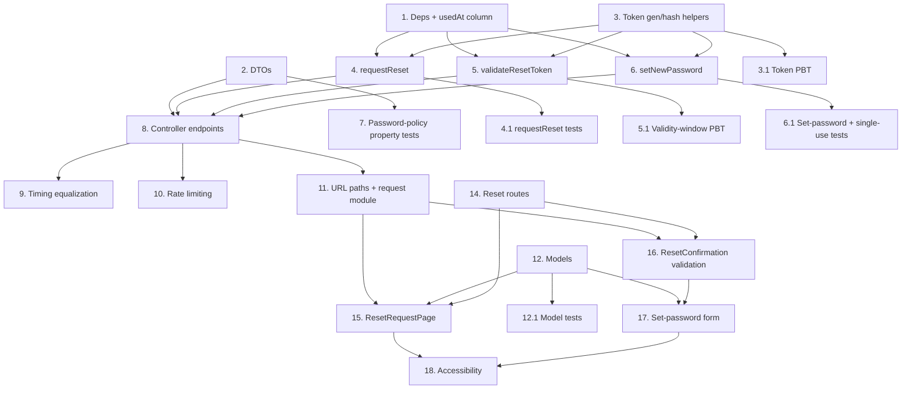

# Implementation Plan

## Overview

This plan implements password reset across the `mother-ship-nest` backend and the `lawma_app` frontend. Backend tasks come first because the frontend request module and pages consume the backend contract. Property-based tests (`fast-check`) and unit tests (Jest on the backend, the frontend's configured runner) are written alongside the code they validate.

## Tasks

### Backend (`mother-ship-nest`)

- [ ] 1. Add dependencies and the `usedAt` token column
  - Add `@nestjs/throttler` and `fast-check` (dev) to the backend `package.json` and install.
  - Add a nullable `usedAt: Date | null` column (`timestamptz`) to the `Token` entity (`src/project/entities/Token.entity.ts`).
  - Generate a TypeORM migration that adds the `usedAt` column to the `token` table (no backfill; existing rows default to `null`).
  - _Requirements: 3.2, 5.7, 6.1_

- [ ] 2. Add reset DTOs
  - Add `RequestPasswordResetDto`, `ValidateResetTokenDto`, and `ConfirmPasswordResetDto` to `src/auth/dtos/dto.ts` using class-validator decorators.
  - `ConfirmPasswordResetDto.newPassword` enforces `@MinLength(8, …)` and the character-class `@Matches(...)` with the exact messages from requirements.
  - _Requirements: 2.1, 5.2, 5.3, 5.6_

- [ ] 3. Implement token generation and hashing helpers in `AuthService`
  - Add private `generateResetToken()` using `crypto.randomBytes(32)` → URL-safe base64 plaintext, and `hashResetToken(plaintext)` → `sha256` hex digest.
  - _Requirements: 3.1, 3.2_

- [ ] 3.1 Write property-based tests for token generation/hashing
  - Property 1 (confidentiality): stored hash equals `sha256(plaintext)` and never equals plaintext.
  - Property 2 (entropy): plaintext derives from ≥128 bits of randomness (≥32 random bytes; sample uniqueness across many draws).
  - _Requirements: 3.1, 3.2_

- [ ] 4. Implement `AuthService.requestReset(email)`
  - Look up `User` by email; if absent, return without sending email.
  - If present, in a transaction: mark existing unused+unexpired `RESET_PASSWORD` tokens as used, generate a token, persist a `Token` row (hash, `expiry=1800`, purpose, `userId`), build the reset link from `FRONTEND_BASE_URL`, and send the email via `SharedService`.
  - _Requirements: 2.4, 2.5, 3.1, 3.2, 3.3, 3.4_

- [ ] 4.1 Write tests for `requestReset` enumeration behavior and single-active-token
  - Unit: non-matching email sends no email; matching email persists a token and sends the link.
  - Property 3 (single active token): after issuing, at most one unused+unexpired `RESET_PASSWORD` token exists for the user.
  - Property 9 (enumeration): the resolved outcome is observationally identical for matching vs non-matching emails.
  - _Requirements: 2.4, 2.5, 3.4, 8.1_

- [ ] 5. Implement `AuthService.validateResetToken(token)`
  - Hash the token, look up by `valueOfToken` + `RESET_PASSWORD` purpose, and return `'invalid'` (not found or used), `'expired'` (past `createdAt + expiry`), or `'valid'` using `SharedService.isTokenExpired`.
  - _Requirements: 4.2, 4.3, 4.4, 4.5_

- [ ] 5.1 Write property-based tests for validity-window classification
  - Property 4: token classified `expired` exactly when `now ≥ createdAt + expiry`, otherwise by found/used state, across randomized issuance/now offsets.
  - _Requirements: 3.3, 4.2, 4.3, 4.4, 4.5, 6.2_

- [ ] 6. Implement `AuthService.setNewPassword(token, newPassword)`
  - In a transaction: load token by hash; reject (typed `INVALID_RESET_TOKEN`) when not found/used/expired without touching the password.
  - On success: hash via `SharedService.hashPassword`, update the `ProjectUserPassword` row for `token.userId`, and mark the token used with a conditional `UPDATE … WHERE usedAt IS NULL` checking affected rows.
  - _Requirements: 5.5, 5.6, 5.7, 6.1, 6.2, 6.3_

- [ ] 6.1 Write tests for set-password and single-use guarantees
  - Property 5 (single use): a consumed token never validates/accepts again; two concurrent confirms succeed at most once.
  - Property 6 (no change on rejection): invalid/used/expired token leaves the `ProjectUserPassword` hash unchanged.
  - Unit: valid token updates the hash and sets `usedAt`.
  - _Requirements: 5.6, 5.7, 6.1, 6.2, 6.3_

- [ ] 7. Add password-policy property tests at the DTO boundary
  - Property 7 (policy equivalence): the DTO accepts a password iff ≥8 chars and contains upper, lower, digit, and special, cross-checked against an independent predicate.
  - _Requirements: 5.2, 5.3, 5.6_

- [ ] 8. Wire reset endpoints into `AuthController`
  - Add `POST /auth/password-reset/request`, `/validate`, and `/confirm` (public, no `IsAuthenticated`), returning the standard success bodies and the `{ status }` discriminator for validate.
  - Map `INVALID_RESET_TOKEN` / `WEAK_PASSWORD` to `400` with the typed body shape; ensure request returns the identical message in both branches.
  - _Requirements: 2.3, 2.6, 2.7, 4.1, 5.5, 7.1, 7.2, 7.3_

- [ ] 9. Add enumeration timing equalization on the request endpoint
  - Dispatch the email send without blocking the response on the network round-trip, and pad the handler to a fixed minimum duration so matching/non-matching branches return after approximately equal time.
  - _Requirements: 8.1_

- [ ] 10. Configure rate limiting with `@nestjs/throttler`
  - Register `ThrottlerModule` with a 900s window and apply throttling to the three reset endpoints.
  - Per-email (5/15min) and per-IP (10/15min) limits on `request`; per-IP invalid-token (10/15min) limit counted on the invalid path of `validate`/`confirm`.
  - Return `429` with a generic body that does not reveal account existence.
  - _Requirements: 8.2, 8.3, 8.4, 8.5_

### Frontend (`lawma_app`)

- [ ] 11. Add URL paths and the reset request module
  - Add `PASSWORD_RESET_REQUEST`, `PASSWORD_RESET_VALIDATE`, `PASSWORD_RESET_CONFIRM` to `UrlPathsEnum`.
  - Create `src/lib/requests/password-reset.request.ts` with `requestPasswordReset`, `validateResetToken`, and `submitNewPassword`, calling the `api` instance with `Authorization: undefined`.
  - _Requirements: 2.3, 4.1, 5.5_

- [ ] 12. Add validation models
  - Create `PasswordResetRequestModel` (email) and `PasswordResetConfirmModel` (newPassword length + character-class, confirmPassword) extending `BaseModel`, with the exact requirement messages.
  - _Requirements: 2.2, 5.2, 5.3, 5.4_

- [ ] 12.1 Write model validation tests
  - Email model rejects malformed emails with "Please enter a valid email".
  - Confirm model enforces length and character-class messages; confirm-match logic yields "Passwords do not match".
  - _Requirements: 2.2, 5.2, 5.3, 5.4_

- [ ] 13. Add the "Forgot password?" entry point to `SigninPage.vue`
  - Add a flat link control inside the manager-only form block that routes to `/auth/forgot-password`; it is absent on the Service Client tab by construction.
  - _Requirements: 1.1, 1.2, 1.3_

- [ ] 14. Add reset routes
  - Add public `/auth/forgot-password` and `/auth/reset-password` children under the existing `/auth` `AuthLayout` route.
  - _Requirements: 1.2, 4.1_

- [ ] 15. Build `ResetRequestPage.vue`
  - Email input + submit bound to the model; block the API call on invalid email; show a loading state and disable submit while pending.
  - On any resolved response, show "If an account exists for that email, a reset link has been sent." in an `aria-live` region; show the generic error message on network/server failure.
  - _Requirements: 2.1, 2.2, 2.3, 2.7, 7.4, 7.5, 9.1, 9.2, 9.4_

- [ ] 16. Build `ResetConfirmationPage.vue` state machine and token validation
  - On mount, read `token` from the query and call `validateResetToken`; render `validating` → `form` (valid) or `link-error` (invalid/expired) hiding the password fields and offering a request-new-reset link.
  - _Requirements: 4.1, 4.6_

- [ ] 17. Implement the set-password form on `ResetConfirmationPage.vue`
  - New-password and confirm-password inputs with a visibility toggle; pre-submit length/character-class/match validation; on valid input call `submitNewPassword` with a loading state and disabled submit.
  - Success → show "Your password has been reset" and a "Go to sign in" control; token rejection → `link-error`; weak-password rejection → field message with inputs retained; network error → generic message with resubmit.
  - _Requirements: 5.1, 5.5, 5.8, 7.1, 7.2, 7.3, 7.4, 7.5_

- [ ] 18. Apply accessibility treatment to both reset pages
  - Associated labels for every input, field-associated error text, logical keyboard focus order, `aria-live` status regions, and a state-reflecting accessible name on the visibility toggle.
  - _Requirements: 9.1, 9.2, 9.3, 9.4, 9.5_

## Task Dependency Graph



```json
{
  "waves": [
    { "wave": 1, "tasks": ["1", "2", "3", "12", "13", "14"] },
    { "wave": 2, "tasks": ["3.1", "4", "5", "6", "7", "12.1"] },
    { "wave": 3, "tasks": ["4.1", "5.1", "6.1", "8"] },
    { "wave": 4, "tasks": ["9", "10", "11"] },
    { "wave": 5, "tasks": ["15", "16"] },
    { "wave": 6, "tasks": ["17"] },
    { "wave": 7, "tasks": ["18"] }
  ]
}
```

## Notes

- Backend tasks 1–10 establish the API contract; frontend tasks 11–18 consume it. Test sub-tasks depend on the implementation they validate.
- Property-based tests use `fast-check` and reference the numbered correctness properties in `design.md`. Backend tests run under the existing Jest config (`*.spec.ts`); the frontend has no test runner configured yet, so task 12.1 includes setting up the standard runner for the Quasar/Vite stack if one is not added by then.
- The two repos are separate working trees (`mother-ship-nest` and `lawma_app`); tasks state which repo they apply to.
- Tasks 9 and 10 depend on the endpoints existing (task 8) but are independent of each other.
